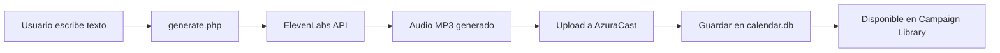
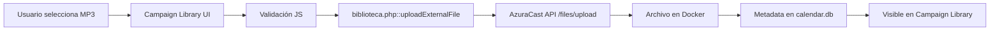

# 🏗️ Arquitectura del Sistema de Audio - MBI-v4
## Documentación Técnica para Desarrolladores

*Última actualización: 29 de Agosto, 2025*

---

## 📊 Resumen Ejecutivo

El sistema MBI-v4 es una plataforma de radio automatizada para centros comerciales que integra:
- **Generación TTS** (Text-to-Speech) via ElevenLabs
- **Streaming de radio** via AzuraCast (Docker)
- **Programación automática** de contenido
- **Gestión de biblioteca** de audio
- **Sistema de interrupciones** en tiempo real

---

## 🗄️ Arquitectura de Bases de Datos

### Base de Datos Principal: SQLite
**Ubicación**: `/var/www/mbi-v4/calendario/api/db/calendar.db`

⚠️ **CRÍTICO**: Esta es la BD principal que utilizan TODOS los módulos activos.

#### Tablas Principales:

```sql
-- 1. audio_metadata: Almacena información de todos los archivos de audio
CREATE TABLE audio_metadata (
    id INTEGER PRIMARY KEY AUTOINCREMENT,
    filename TEXT UNIQUE NOT NULL,      -- Nombre único del archivo
    display_name TEXT,                   -- Nombre legible para UI
    description TEXT,                    -- Descripción opcional
    category TEXT,                       -- Categoría: general, ofertas, horarios, etc.
    file_size INTEGER,                   -- Tamaño en bytes
    duration REAL,                       -- Duración en segundos
    play_count INTEGER DEFAULT 0,        -- Veces reproducido
    radio_sent_count INTEGER DEFAULT 0,  -- Veces enviado a radio
    is_active INTEGER DEFAULT 1,         -- Estado activo/inactivo
    is_saved INTEGER DEFAULT 0,          -- Marcado como guardado (Campaign Library)
    saved_at TIMESTAMP,                  -- Fecha de guardado
    created_at TIMESTAMP DEFAULT CURRENT_TIMESTAMP,
    updated_at TIMESTAMP DEFAULT CURRENT_TIMESTAMP,
    created_by TEXT,                     -- Usuario creador
    tags TEXT,                           -- Tags separados por comas
    notes TEXT                           -- Notas adicionales
);

-- 2. audio_schedule: Programaciones activas
CREATE TABLE audio_schedule (
    id INTEGER PRIMARY KEY AUTOINCREMENT,
    filename TEXT NOT NULL,              -- Referencia a audio_metadata.filename
    title TEXT,                          -- Título de la programación
    schedule_type TEXT NOT NULL,         -- 'interval', 'specific', 'once'
    interval_hours INTEGER,               -- Para tipo interval
    interval_minutes INTEGER,             -- Para tipo interval  
    schedule_time TEXT,                   -- JSON array de horas ["14:00", "18:00"]
    schedule_days TEXT,                   -- JSON array días ["monday", "tuesday"]
    start_date DATE,                      -- Fecha inicio
    end_date DATE,                        -- Fecha fin (opcional)
    is_active INTEGER DEFAULT 1,          -- Estado
    priority INTEGER DEFAULT 1,           -- Prioridad ejecución
    created_at TIMESTAMP DEFAULT CURRENT_TIMESTAMP,
    updated_at TIMESTAMP DEFAULT CURRENT_TIMESTAMP,
    created_by TEXT,
    notes TEXT,                           -- JSON con metadata adicional
    category TEXT,                        -- Categoría heredada del audio
    last_executed TIMESTAMP,              -- Última ejecución
    execution_count INTEGER DEFAULT 0     -- Contador de ejecuciones
);

-- 3. audio_schedule_log: Historial de ejecuciones
CREATE TABLE audio_schedule_log (
    id INTEGER PRIMARY KEY AUTOINCREMENT,
    schedule_id INTEGER,                  -- Referencia a audio_schedule.id
    filename TEXT,
    executed_at TIMESTAMP DEFAULT CURRENT_TIMESTAMP,
    status TEXT,                          -- 'success', 'failed', 'skipped'
    error_message TEXT,                   -- Mensaje de error si falló
    duration REAL                         -- Duración de la ejecución
);

-- 4. audio_favorites: Favoritos del usuario (legacy, migrado a is_saved)
CREATE TABLE audio_favorites (
    id INTEGER PRIMARY KEY AUTOINCREMENT,
    filename TEXT UNIQUE NOT NULL,
    added_at TIMESTAMP DEFAULT CURRENT_TIMESTAMP,
    added_by TEXT,
    notes TEXT
);
```

### Base de Datos Secundaria (DEPRECADA)
**Ubicación**: `/var/www/mbi-v4/api/db/calendar.db`

⚠️ **NO USAR** - Solo existe por compatibilidad legacy con audio-scheduler.php

---

## 🔄 Flujo de Datos del Sistema

### 1. Generación de Audio TTS



**Archivos involucrados**:
- `/api/generate.php` - Generación TTS
- `/api/services/radio-service.php` - Upload a AzuraCast
- `/calendario/api/db/calendar.db` - Almacenamiento metadata

### 2. Upload de Archivos Externos



**Archivos involucrados**:
- `/modules/campaign-library/index.js` - UI y validación
- `/api/biblioteca.php::uploadExternalFile()` - Backend upload
- `/calendario/api/db/calendar.db` - Almacenamiento con `category='archivos_subidos'`

### 3. Sistema de Programación (Scheduler)

```mermaid
graph LR
    A[Cron cada minuto] --> B[audio-scheduler.php]
    B --> C[Consulta calendar.db]
    C --> D{¿Hay programación activa?}
    D -->|Sí| E[interruptRadio()]
    D -->|No| F[Esperar próximo ciclo]
    E --> G[Log en audio_schedule_log]
```

**Archivos involucrados**:
- `/api/audio-scheduler.php` - Script de cron
- `/api/services/radio-service.php::interruptRadio()` - Interrupción
- `/calendario/api/db/calendar.db` - Programaciones y logs

---

## 📁 Estructura de Archivos Críticos

### Backend (PHP)

#### `/api/biblioteca.php`
```php
// Funciones principales:
listLibraryFiles()        // Lista archivos desde AzuraCast Docker
deleteLibraryFile()       // Elimina archivo de AzuraCast
sendLibraryToRadio()      // Envía archivo a reproducción inmediata
renameLibraryFile()       // Renombra archivo con descripción
uploadExternalFile()      // [NUEVO] Upload de archivos externos
```

#### `/api/generate.php`
```php
// Generación TTS y gestión de audio
generateTTS()            // Genera audio con ElevenLabs
saveToLibrary()         // Marca audio como guardado (is_saved=1)
uploadToAzuracast()     // Sube archivo a Docker
```

#### `/api/saved-messages.php`
```php
// API para Campaign Library
getSavedMessages()      // Obtiene archivos con is_saved=1
toggleSaved()          // Marca/desmarca como guardado
updateMetadata()       // Actualiza información del archivo
```

#### `/api/audio-scheduler.php`
```php
// Scheduler de programaciones
checkSchedules()       // Verifica programaciones activas
executeSchedule()      // Ejecuta una programación
logExecution()        // Registra en audio_schedule_log
```

#### `/api/services/radio-service.php`
```php
// Integración con AzuraCast
interruptRadio($filename)     // Interrumpe radio con archivo
uploadToStation($file)         // Sube archivo a estación
assignToPlaylist($file)        // Asigna a playlist "grabaciones"
```

### Frontend (JavaScript)

#### `/modules/campaign-library/index.js`
```javascript
// Módulo principal de Campaign Library
loadMessages()           // Carga mensajes guardados
handleFileSelected()     // Maneja upload de archivos
uploadAudioFile()       // Envía archivo al backend
scheduleMessage()       // Abre modal de programación
```

#### `/modules/calendar/index.js`
```javascript
// Módulo de calendario
loadAvailableFiles()    // Carga archivos disponibles
loadCalendarEvents()    // Carga programaciones
createSchedule()        // Crea nueva programación
updateSchedule()        // Actualiza programación existente
```

#### `/shared/api-client.js`
```javascript
// Cliente API centralizado
post(endpoint, data)    // POST requests
get(endpoint)          // GET requests
baseURL = '/api'       // Base URL para todas las peticiones
```

---

## 🐳 Integración con AzuraCast (Docker)

### Configuración
```php
// /api/config.php
AZURACAST_BASE_URL = 'http://51.222.25.222'
AZURACAST_API_KEY = 'c3802cba5b5e61e8:fed31be9adb82ca57f1cf482d170851f'
AZURACAST_STATION_ID = 1
PLAYLIST_ID_GRABACIONES = 3  // Playlist "grabaciones" (minúscula)
```

### Rutas en Docker
```bash
# Carpeta de archivos
/var/azuracast/stations/test/media/Grabaciones/  # Carpeta "Grabaciones" (mayúscula)

# Socket de Liquidsoap para interrupciones
/var/azuracast/stations/test/config/liquidsoap.sock
```

### Comandos Docker Utilizados
```bash
# Copiar archivo desde Docker
docker cp azuracast:/path/to/file /local/path

# Ejecutar comando en Docker
docker exec azuracast [command]

# Interrupción via Liquidsoap
echo "interrupting_requests.push file_uri" | \
  socat - UNIX-CONNECT:/path/to/liquidsoap.sock
```

---

## 🔍 Patrones de Nombres de Archivo

### Archivos TTS Generados
```
Formato: tts{timestamp}[_descripcion].mp3
Ejemplo: tts20250829142510_oferta_especial.mp3

Regex validación: /^tts\d{14}(_[a-zA-Z0-9_\-ñÑáéíóúÁÉÍÓÚ]+)?\.mp3$/
```

### Archivos Externos Subidos
```
Formato: {nombre_original_sanitizado}.mp3
Ejemplo: Big_Thief_-_Shark_Smile__Edit_.mp3

Sanitización: Espacios y caracteres especiales → underscore
Categoría fija: 'archivos_subidos'
```

---

## 🚨 Puntos Críticos y Consideraciones

### 1. Base de Datos
- ✅ **USAR**: `/calendario/api/db/calendar.db`
- ❌ **NO USAR**: `/api/db/calendar.db` (legacy)
- **Migración pendiente**: Unificar audio-scheduler.php para usar BD principal

### 2. Rutas de API
- Usar rutas absolutas: `/api/endpoint.php`
- apiClient ya agrega `/api`, usar: `/endpoint.php`
- Evitar duplicación: NO usar `api/endpoint.php` con apiClient

### 3. Límites del Sistema
- **Upload máximo**: 12MB (configurado en PHP y Nginx)
- **Formatos permitidos**: MP3, WAV, FLAC, AAC, Ogg, M4A, Opus
- **Timeout uploads**: 60 segundos
- **Archivos por consulta**: 50 (paginación implícita)

### 4. Categorías del Sistema
```javascript
categories = [
    'general',
    'ofertas', 
    'emergencias',
    'horarios',
    'eventos',
    'informacion',
    'servicios',
    'archivos_subidos'  // Para uploads externos
]
```

### 5. Estados y Flags
```sql
-- Estados de archivos
is_active = 1/0      -- Archivo activo/inactivo
is_saved = 1/0       -- Aparece en Campaign Library

-- Estados de programaciones
is_active = 1/0      -- Programación activa/inactiva

-- Tipos de programación
schedule_type = 'interval'  -- Repetir cada X tiempo
schedule_type = 'specific'  -- Horas específicas
schedule_type = 'once'      -- Una sola vez
```

---

## 🔄 Flujos de Trabajo Comunes

### Agregar un archivo a Campaign Library
1. Archivo debe existir en AzuraCast
2. Debe tener registro en `audio_metadata`
3. Debe tener `is_saved = 1`
4. Aparecerá en `/api/saved-messages.php`

### Programar un archivo
1. Archivo debe estar en Campaign Library
2. Usuario abre modal de programación
3. Se crea registro en `audio_schedule`
4. Cron ejecuta según configuración

### Reproducir archivo inmediatamente
1. Llamar a `sendLibraryToRadio()`
2. Ejecuta `interruptRadio()`
3. Usa socket Liquidsoap
4. Radio interrumpida con archivo

---

## 🐛 Debugging y Logs

### Ubicación de Logs
```bash
/var/www/mbi-v4/api/logs/
├── biblioteca-YYYY-MM-DD.log      # Operaciones de biblioteca
├── tts-YYYY-MM-DD.log             # Generación TTS
├── scheduler/YYYY-MM-DD.log       # Ejecución de programaciones
└── audio-metadata-YYYY-MM-DD.log  # Operaciones de metadata
```

### Comandos Útiles de Debug
```bash
# Ver archivos en AzuraCast
docker exec azuracast ls -la /var/azuracast/stations/test/media/Grabaciones/

# Ver programaciones activas
sqlite3 /var/www/mbi-v4/calendario/api/db/calendar.db \
  "SELECT * FROM audio_schedule WHERE is_active=1;"

# Ver logs en tiempo real
tail -f /var/www/mbi-v4/api/logs/biblioteca-$(date +%Y-%m-%d).log

# Test de endpoint
curl -X POST -H "Content-Type: application/json" \
  -d '{"action":"list"}' \
  http://localhost:3001/api/saved-messages.php
```

---

## 📝 TODOs y Mejoras Pendientes

1. **Upload de archivos externos**: Especificar carpeta correcta en AzuraCast para reproducción
2. **Migración BD**: Unificar todas las referencias a una sola BD
3. **Sincronización**: Importar archivos existentes en AzuraCast a la BD local
4. **Validación MIME**: Mejorar detección de tipos MIME en uploads
5. **UI Feedback**: Mejorar mensajes de error/éxito en frontend

---

## 🤝 Convenciones del Proyecto

- **Naming**: camelCase para JS, snake_case para PHP
- **Logs**: Siempre usar `logMessage()` en PHP
- **Errores**: Capturar con try/catch y loggear
- **BD**: Siempre usar prepared statements
- **API**: Respuestas JSON con `{success: bool, data/error: ...}`

---

*Documentación generada para el sistema MBI-v4 - Radio Automatizada Mall Barrio Independencia*