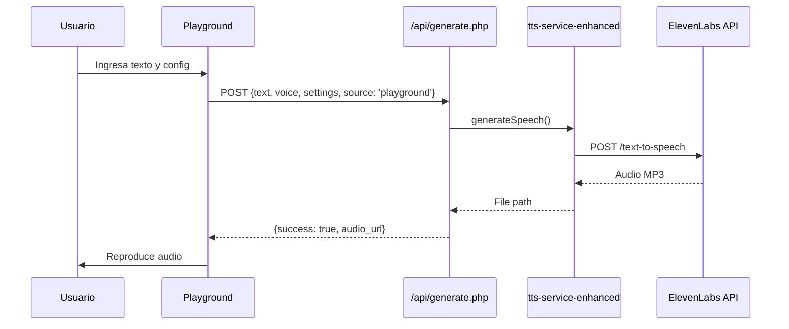
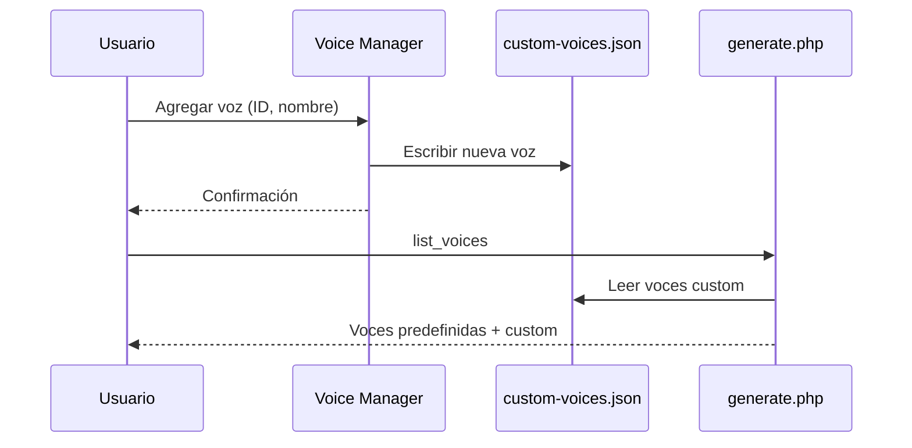

# 🧪 MBI-v3 API Playground - Documentación Técnica

## 📋 Índice
1. [Visión General](#visión-general)
2. [Arquitectura del Sistema](#arquitectura-del-sistema)
3. [Componentes Principales](#componentes-principales)
4. [APIs y Servicios](#apis-y-servicios)
5. [Flujo de Datos](#flujo-de-datos)
6. [Guía de Uso](#guía-de-uso)
7. [Configuración y Despliegue](#configuración-y-despliegue)

## 🎯 Visión General

### ¿Qué es el Playground?
El **MBI-v3 API Playground** es un entorno de desarrollo y pruebas interactivo para el sistema TTS (Text-to-Speech) del Mall Barrio Independencia. Proporciona herramientas visuales para:

- 🎤 **Probar voces y configuraciones** de síntesis de voz
- 🎭 **Explorar y comparar** diferentes voces disponibles
- 📝 **Construir y probar** templates de mensajes
- 📊 **Monitorear** el uso y rendimiento del sistema
- 🛠️ **Administrar** voces personalizadas y configuraciones

### Propósito
- **Desarrollo:** Facilitar pruebas rápidas sin afectar producción
- **Debug:** Visualizar logs y respuestas API en tiempo real
- **Optimización:** Encontrar las mejores configuraciones para cada tipo de mensaje
- **Administración:** Gestionar voces y monitorear el consumo de quota

## 🏗️ Arquitectura del Sistema

```
playground/
├── index.html                 # Interfaz principal SPA
├── api/                       # Endpoints PHP del playground
│   ├── voice-manager.php      # CRUD de voces personalizadas
│   ├── quota.php             # Consulta de quota ElevenLabs
│   ├── logs.php              # Visualización de logs
│   ├── ping.php              # Health check
│   ├── clean-voices.php      # Limpieza de voces duplicadas
│   └── voice-admin.php       # Administración avanzada
├── assets/
│   ├── css/
│   │   └── playground.css    # Estilos con tema dark/light
│   └── js/
│       ├── playground.js     # Controlador principal
│       └── monitors.js        # Sistema de monitoreo
└── logger/
    └── tts-logger.php        # Sistema de logging centralizado
```

### Stack Tecnológico
- **Frontend:** Vanilla JavaScript ES6+ (sin frameworks)
- **Backend:** PHP 8.x
- **Estilos:** CSS3 con variables personalizadas
- **Gráficas:** Chart.js 4.4.0
- **API Externa:** ElevenLabs TTS API

## 🔧 Componentes Principales

### 1. TTS Tester (`tts-tester`)
**Propósito:** Interfaz principal para generar audio desde texto

**Características:**
- Editor de texto con contador de caracteres (max 5000)
- Selector de voces dinámico
- Controles deslizantes para ajustar:
  - **Style** (0-100): Expresividad de la voz
  - **Stability** (0-100): Consistencia tonal
  - **Similarity** (0-100): Similitud con la voz original
  - **Speaker Boost**: Mejora de claridad
- Reproductor de audio integrado
- Visualización de respuesta API

**Flujo:**
1. Usuario ingresa texto
2. Selecciona voz y ajusta parámetros
3. Click en "Generar Audio"
4. Request a `/api/generate.php` con source: 'playground'
5. Audio se reproduce automáticamente
6. Logs se actualizan en tiempo real

### 2. Voice Explorer (`voice-explorer`)
**Propósito:** Comparar todas las voces disponibles con el mismo texto

**Características:**
- Input de texto de prueba compartido
- Grid de tarjetas de voz mostrando:
  - Nombre y género
  - Voice ID
  - Reproductor individual
  - Estado de generación
- Botón "Generar Todas las Muestras"
- Identificación visual de voces custom vs predefinidas

### 3. Template Builder (`template-builder`)
**Propósito:** Crear y probar templates de mensajes con variables

**Características:**
- Editor con soporte para variables `{{variable}}`
- Categorías: ofertas, eventos, información, emergencias
- Preview en tiempo real
- Detección automática de variables
- Test de audio con valores de ejemplo

### 4. Monitors (`monitors`)
**Propósito:** Dashboard de monitoreo del sistema

**Paneles:**
- **Uso de Quota:** Gráfica circular del consumo vs límite
- **Generaciones Recientes:** Lista de últimas 10 generaciones
- **Performance:** Tiempos de respuesta promedio
- **Voces Más Usadas:** Ranking de popularidad

**Actualización:** Auto-refresh cada 30 segundos

### 5. Tools (`tools`)
**Herramientas disponibles:**

#### Text Analyzer
- Cuenta caracteres, palabras, oraciones
- Estima duración del audio
- Detecta idioma predominante

#### Settings Optimizer
- Sugiere configuraciones según tipo de mensaje:
  - Emergencias: Alta stability, bajo style
  - Ofertas: Alto style, media stability
  - Información: Valores balanceados

#### Voice Manager
- Agregar voces custom con Voice ID de ElevenLabs
- Listar voces personalizadas
- Eliminar voces no utilizadas
- Test de validez de Voice ID

#### Cost Calculator
- Estima costos mensuales basado en:
  - Mensajes por mes
  - Longitud promedio
  - Tarifa de ElevenLabs

## 🔌 APIs y Servicios

### `/playground/api/voice-manager.php`
Gestión CRUD de voces personalizadas

**Endpoints:**
```php
POST /voice-manager.php
{
  "action": "add|list|delete|test",
  "voice_id": "xxx",      // Para add/test
  "voice_name": "Nombre",  // Para add
  "voice_gender": "M|F",   // Para add
  "voice_key": "clave"     // Para delete
}
```

**Almacenamiento:** `/api/data/custom-voices.json`

### `/playground/api/quota.php`
Consulta el estado de quota de ElevenLabs

**Response:**
```json
{
  "used": 125000,
  "limit": 500000,
  "remaining": 375000,
  "reset_date": "2024-12-01"
}
```

### `/playground/api/logs.php`
Obtiene logs recientes del sistema

**Parameters:**
- `lines`: Número de líneas (default: 100)
- `category`: Categoría de log (tts-playground, general)
- `level`: Nivel mínimo (DEBUG, INFO, WARNING, ERROR)

### `/playground/logger/tts-logger.php`
Sistema de logging centralizado

**Niveles:**
- `DEBUG` (0): Información detallada de debugging
- `INFO` (1): Eventos informativos normales
- `WARNING` (2): Situaciones anómalas pero manejables
- `ERROR` (3): Errores que requieren atención

**Features:**
- Rotación automática al superar 10MB
- Archivos diarios con formato: `category-YYYY-MM-DD.log`
- Parsing de contexto JSON
- Headers de debug para modo desarrollo

## 📊 Flujo de Datos

### Generación de Audio


### Gestión de Voces Custom


## 📖 Guía de Uso

### Caso de Uso 1: Probar un Anuncio
1. Navegar a **TTS Tester**
2. Escribir: "Atención visitantes, el mall cerrará en 30 minutos"
3. Seleccionar voz "Fernanda"
4. Ajustar Style a 70% para mayor expresividad
5. Click en "Generar Audio"
6. Escuchar y ajustar si es necesario

### Caso de Uso 2: Agregar Voz Personalizada
1. Obtener Voice ID desde ElevenLabs
2. Ir a **Tools > Voice Manager**
3. Ingresar ID y nombre descriptivo
4. Click en "Agregar Voz"
5. La voz aparece inmediatamente en todos los selectores

### Caso de Uso 3: Monitorear Consumo
1. Ver badge de quota en header (actualización automática)
2. Para detalles, ir a **Monitors**
3. Revisar gráfica de consumo
4. Ver historial de generaciones recientes

### Caso de Uso 4: Debug de Problemas
1. Activar panel de logs (botón 📋 en header)
2. Realizar la acción problemática
3. Ver logs en tiempo real
4. Filtrar por nivel (ERROR, WARNING)

## ⚙️ Configuración y Despliegue

### Requisitos
- PHP 8.0+
- Permisos de escritura en:
  - `/api/data/` (voces custom)
  - `/playground/logs/` (archivos de log)
  - `/api/temp/` (archivos de audio)

### Variables de Entorno
En `/api/config.php`:
```php
define('ELEVENLABS_API_KEY', 'your-api-key');
define('ELEVENLABS_BASE_URL', 'https://api.elevenlabs.io/v1');
```

### Instalación
1. Clonar repositorio
2. Configurar API keys en `config.php`
3. Dar permisos de escritura a directorios
4. Acceder a `/playground/` en navegador

### Modo Debug
Agregar `?debug=1` a la URL para:
- Ver logs detallados en consola
- Headers de debug en responses
- Tiempos de ejecución

### Seguridad
- El playground debe estar protegido por autenticación
- No exponer en producción sin restricciones
- Logs pueden contener información sensible
- Validar Voice IDs antes de guardar

## 🚀 Mejoras Futuras

### Próximas Features
- [ ] Historial de generaciones con búsqueda
- [ ] Comparación A/B de configuraciones
- [ ] Export/Import de configuraciones
- [ ] Webhooks para eventos
- [ ] Cache de audios generados
- [ ] Modo offline con mocks

### Optimizaciones
- [ ] Lazy loading de secciones
- [ ] Web Workers para procesamiento
- [ ] IndexedDB para cache local
- [ ] Compresión de logs antiguos
- [ ] API Rate limiting

---

**Versión:** 1.0.0  
**Última actualización:** 2024-11-29  
**Autor:** Sistema MBI-v3 Development Team