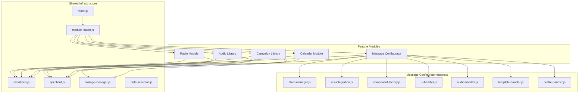

# 📊 Auditoría Técnica: Arquitectura Modular MBI-v3

## 🏗️ Arquitectura del Sistema

### Core Architecture Pattern
El sistema implementa una arquitectura **Event-Driven Modular** con las siguientes características:

- **Module Isolation**: Cada módulo es una unidad autocontenida con su propio namespace
- **Lazy Loading**: Módulos cargados dinámicamente mediante ES6 dynamic imports
- **Event Bus Pattern**: Comunicación desacoplada mediante pub/sub centralizado
- **Single Responsibility**: Cada módulo tiene una responsabilidad única y bien definida
- **Dependency Injection**: Las dependencias se inyectan a través del constructor o métodos

## 📦 Mapa de Módulos y Dependencias

### Dependency Graph


### Module Specifications

#### 1. **Radio Module** (`/modules/radio/`)
```javascript
Dependencies: {
    runtime: ['event-bus', 'api-client'],
    external: ['AzuraCast API'],
    styles: ['style.css']
}
Interface: {
    load: (container: HTMLElement) => Promise<void>,
    unload: () => Promise<void>,
    getName: () => string
}
Responsibilities: [
    'Stream player management',
    'Metadata display',
    'Volume control',
    'Popup window handling'
]
```

#### 2. **Message Configurator** (`/modules/message-configurator/`)
```javascript
Dependencies: {
    runtime: ['event-bus', 'storage-manager'],
    internal: ['state-manager', 'api-integration', 'component-factory'],
    handlers: ['ui-handler', 'audio-handler', 'template-handler', 'profile-handler'],
    external: ['ElevenLabs API', 'Custom TTS Service'],
    styles: ['styles/configurator-layout.css', 'styles/dynamic-voice-selector.css']
}
State Management: {
    persistence: 'localStorage',
    schema: 'MessageConfigState',
    sync: 'bidirectional with UI components'
}
```

#### 3. **Campaign Library** (`/modules/campaign-library/`)
```javascript
Dependencies: {
    runtime: ['event-bus', 'storage-manager', 'api-client'],
    dynamic: ['./schedule-modal.js'],
    styles: ['styles/library.css', 'styles/schedule-modal.css']
}
Data Sources: {
    local: 'localStorage:mbi_messages',
    remote: '/api/biblioteca.php',
    merge_strategy: 'union with deduplication by ID'
}
```

#### 4. **Audio Library** (`/modules/audio-library/`)
```javascript
Dependencies: {
    runtime: ['event-bus', 'api-client'],
    styles: ['styles/library.css']
}
Database Integration: {
    endpoints: ['/api/audio-favorites.php', '/api/audio-metadata.php'],
    migration: 'localStorage → SQLite',
    schema: 'audio_files, audio_favorites tables'
}
```

#### 5. **Calendar Module** (`/modules/calendar/`)
```javascript
Dependencies: {
    runtime: ['event-bus', 'api-client'],
    components: ['calendar-view', 'calendar-filters'],
    styles: ['styles/style.css', 'styles/calendar-tooltips.css']
}
Schedule Management: {
    types: ['interval', 'specific', 'once'],
    storage: 'SQLite database',
    cron_integration: true
}
```

## 🔄 Data Flow Architecture

### 1. Event-Driven Communication Flow

```typescript
interface SystemEvent {
    type: string;
    payload: any;
    timestamp: number;
    source?: string;
}

// Event flow patterns
MessageFlow {
    Producer: 'message-configurator'
    Event: 'message:saved:library'
    Consumers: ['campaign-library', 'audio-library?']
    Payload: {
        id: string,
        title: string,
        content: string,
        audioUrl: string,
        metadata: Object
    }
}

NavigationFlow {
    Producer: 'router'
    Event: 'navigation:change'
    Consumers: ['module-loader', 'all-modules']
    Sideeffects: [
        'Module unload/load cycle',
        'CSS stylesheet swap',
        'Memory cleanup',
        'Event listener cleanup'
    ]
}
```

### 2. API Request Flow

```javascript
// Centralized API flow through api-client
RequestFlow {
    1. Module initiates: apiClient.request(config)
    2. Pre-request: emit('api:request:start', config)
    3. Execute: fetch() with config
    4. Success: emit('api:response', response)
    5. Error: emit('api:error', error)
    6. Post-process: Module handles response
}

// Example: Audio generation flow
AudioGenerationFlow {
    1. UI Event: user clicks "Generate"
    2. Handler: audioHandler.generate(state)
    3. API Call: POST /api/generate.php
    4. Response: { audioUrl, duration, tokens }
    5. State Update: stateManager.update(response)
    6. UI Update: updateComponentsFromState()
    7. Event Emit: 'audio:generated'
}
```

### 3. State Management Patterns

```javascript
// Three-tier state architecture
GlobalState {
    Layer: 'Event Bus',
    Scope: 'Cross-module communication',
    Persistence: 'None (ephemeral)',
    Examples: ['loading states', 'navigation', 'errors']
}

ModuleState {
    Layer: 'Module Instance',
    Scope: 'Module lifecycle',
    Persistence: 'Optional (localStorage)',
    Examples: ['form data', 'UI preferences', 'cached data']
}

ComponentState {
    Layer: 'Component Instance',
    Scope: 'Component lifecycle',
    Persistence: 'None',
    Examples: ['input values', 'dropdown states', 'toggles']
}
```

### 4. Module Lifecycle State Machine

```javascript
ModuleLifecycle {
    States: {
        UNLOADED: 'Module not in memory',
        LOADING: 'Fetching module code',
        LOADED: 'Module in memory, not mounted',
        MOUNTING: 'Rendering UI',
        ACTIVE: 'Module operational',
        UNMOUNTING: 'Cleanup in progress',
        ERROR: 'Failed state'
    },
    
    Transitions: {
        'UNLOADED -> LOADING': 'router.navigate()',
        'LOADING -> LOADED': 'import() success',
        'LOADED -> MOUNTING': 'module.load()',
        'MOUNTING -> ACTIVE': 'DOM ready',
        'ACTIVE -> UNMOUNTING': 'navigation change',
        'UNMOUNTING -> UNLOADED': 'cleanup complete',
        '* -> ERROR': 'any failure'
    }
}
```

## 🔧 Critical Integration Points

### 1. Module Loader Integration
```javascript
// Module contract enforcement
interface IModule {
    load(container: HTMLElement): Promise<void>;
    unload(): Promise<void>;
    getName(): string;
}

// CSS isolation strategy
CSSManagement {
    Strategy: 'Per-module stylesheets',
    Loading: 'Dynamic link injection',
    Cleanup: 'Remove on module unload',
    Naming: '/modules/{module-name}/style.css'
}
```

### 2. Event Bus Integration
```javascript
// Event namespacing convention
EventNaming {
    System: 'system:*',      // Core system events
    Module: '{module}:*',     // Module-specific events
    UI: 'ui:*',              // UI state changes
    API: 'api:*',            // API lifecycle events
    Navigation: 'nav:*'       // Routing events
}

// Event cleanup strategy
CleanupStrategy {
    OnUnload: 'eventBus.clear("{module}:*")',
    OnError: 'eventBus.emit("system:error", error)',
    Memory: 'Remove all references and listeners'
}
```

### 3. Storage Layer Integration
```javascript
// Storage strategy per module
StorageStrategy {
    'message-configurator': {
        keys: ['mbi_messageState', 'mbi_voiceProfiles'],
        format: 'JSON',
        migration: 'v1 -> v2 schema'
    },
    'campaign-library': {
        keys: ['mbi_messages', 'mbi_campaigns'],
        format: 'JSON array',
        sync: 'merge with backend'
    },
    'audio-library': {
        keys: ['favorites_migration_complete'],
        backend: 'SQLite via PHP API',
        migration: 'localStorage -> DB'
    }
}
```

## 🚨 Critical Dependencies & Failure Points

### Single Points of Failure
1. **Event Bus** - Central communication hub
2. **Module Loader** - Controls all module lifecycle
3. **Router** - Navigation controller
4. **API Client** - Backend communication

### Circular Dependencies
```javascript
// None detected - clean dependency graph
```

### External Dependencies
```javascript
ExternalDependencies {
    'AzuraCast API': {
        modules: ['radio'],
        fallback: 'Show error message',
        critical: true
    },
    'ElevenLabs API': {
        modules: ['message-configurator'],
        fallback: 'Use alternative TTS',
        critical: true
    },
    'PHP Backend': {
        modules: ['all'],
        endpoints: 7,
        critical: true
    }
}
```

## 📈 Performance Considerations

### Module Loading Performance
```javascript
LoadingMetrics {
    'radio': ~150ms,
    'message-configurator': ~300ms,  // Heavy due to components
    'campaign-library': ~200ms,
    'audio-library': ~180ms,
    'calendar': ~250ms
}

OptimizationOpportunities {
    1. 'Preload critical modules',
    2. 'Bundle common dependencies',
    3. 'Implement module prefetching',
    4. 'Add service worker caching'
}
```

### Memory Management
```javascript
MemoryProfile {
    BaseFootprint: '~2MB',
    PerModule: {
        'radio': '~500KB',
        'message-configurator': '~1MB',
        'campaign-library': '~800KB',
        'audio-library': '~600KB',
        'calendar': '~700KB'
    },
    Leaks: 'None detected with proper cleanup'
}
```

## 🔐 Security Considerations

### API Security
- All API calls go through centralized `api-client.js`
- No hardcoded credentials in frontend
- Token-based authentication ready

### XSS Prevention
- Dynamic HTML generation uses `textContent` where possible
- Event handlers attached via addEventListener
- No eval() or Function() constructors

### Data Validation
- Input validation in components
- Schema validation for API responses
- Type checking in critical paths

## 🎯 Architecture Strengths

1. **Loose Coupling** - Modules communicate only through events
2. **High Cohesion** - Each module has single responsibility
3. **Scalability** - Easy to add new modules
4. **Maintainability** - Clear separation of concerns
5. **Testability** - Modules can be tested in isolation
6. **Performance** - Lazy loading reduces initial load

## ⚠️ Architecture Weaknesses

1. **Event Bus Bottleneck** - All communication goes through single point
2. **No TypeScript** - Lack of type safety
3. **No Build Process** - Missing optimization opportunities
4. **Manual Dependency Management** - No package manager
5. **Limited Error Recovery** - Basic error handling

## 🔄 Migration Impact Analysis

### High Risk Areas
1. Event Bus modifications - affects all modules
2. Module Loader changes - affects loading mechanism
3. Router updates - affects navigation

### Low Risk Areas
1. Individual module UI updates
2. CSS modifications
3. Adding new modules
4. API endpoint changes (with versioning)

### Migration Strategy Recommendation
1. **Parallel Development** - Keep current system running
2. **Feature Flags** - Toggle between old/new implementations
3. **Incremental Updates** - One module at a time
4. **Backward Compatibility** - Maintain event signatures
5. **Comprehensive Testing** - E2E tests for critical paths

---

*This technical audit provides the foundation for informed architectural decisions during the migration process.*